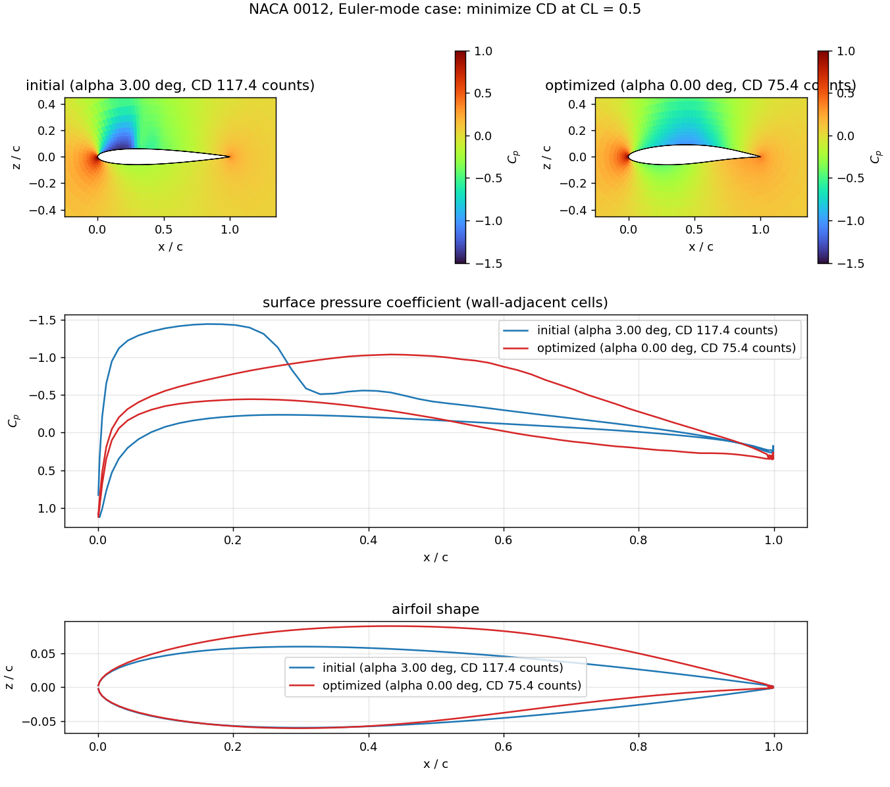

# csdl_dafoam: CSDL - DAFoam interface for aerodynamic shape optimization

**csdl_dafoam** is a CSDL-DAFoam interface for CFD-based aerodynamic shape optimization. It integrates
**lsdo_geo** for geometric parameterization, **IDWarp-JAX** for mesh deformation (the Fortran IDWarp is
supported as an alternative), **modOpt** with **OpenSQP** as the optimizer (PySLSQP selectable), **CSDL** for
automatic differentiation, and **DAFoam** for primal and adjoint computations. It ships with a 2D NACA 0012 case, an
analysis example, an optimization example, and a flow visualization tool.


*Minimum drag at CL = 0.5 on the bundled NACA 0012 (Mach 0.69, Euler-mode case, 4,032-cell mesh): 100 iterations of OpenSQP with
DAFoam adjoint gradients, one frame per iteration ([MP4](docs/_static/optimization.mp4)). The strong shock at 30% chord of the initial design (the sharp jump in surface C_p) is gone and CD falls
from 117 to 75.4 counts (-36%) at CL = 0.5000. Produced by `examples/airfoil_optimization.py` on 4 MPI ranks in about 35 minutes. The mesh is coarse and
nothing constrains thickness, so read it as a demonstration of the workflow, not as a design (see [docs/status.md](docs/status.md)).
Documentation: <https://lsdolab.github.io/csdl_dafoam/>.*



> **Status.** Run end to end on a real DAFoam v5.1.1 / OpenFOAM v2506 built from source (ARM64 Linux): flow solve, adjoint
> (validated against finite differences), 1 and 4 MPI ranks, the optimization above, and the real-solver tests. **Not yet done:**
> the conda recipes have never been built (and are known to be incomplete), the build script has not been run on x86-64, and the
> optimization has not been validated on a finer mesh or in RANS. [docs/status.md](docs/status.md) lists exactly what is and is not
> verified.

## Install

DAFoam runs only on Linux; there are no pip wheels for it. Two procedures have actually been run:

* **On an Apple-silicon Mac:** a Linux VM (Lima), DAFoam built from source inside it, about 2 hours unattended:
  [docs/install-mac.md](docs/install-mac.md).
* **On a Linux machine (Ubuntu 24.04):** the same build script without the VM:
  [docs/install-linux.md](docs/install-linux.md) (verified on ARM64; x86-64 expected to work, untested).

Without DAFoam you can still `pip install` the package, use the geometry tools, and run most of the test suite:

```bash
pip install -r requirements-verified.txt   # csdl_alpha, modopt, idwarp-jax at the commits verified together
pip install -e ".[geometry,opt,test]"
pytest
```

A conda install of the DAFoam stack (recipes in `recipes/`) is planned but experimental and has never been built; see [docs/installation.md](docs/installation.md) for its status.

## Run

```bash
mpirun -np 4 python examples/airfoil_analysis.py                      # one flow solve; CL, CD; saves analysis.png
mpirun -np 4 python examples/airfoil_analysis.py --check-totals       # adjoint vs finite differences
mpirun -np 4 python examples/airfoil_optimization.py --maxiter 100    # min CD at CL = 0.5 (~35 min); saves figures and movie
mpirun -np 4 python examples/airfoil_optimization.py --case naca0012  # RANS instead of Euler mode
mpirun -np 4 python examples/airfoil_optimization.py --optimizer PySLSQP --warper idwarp   # the alternatives
```

The rank count must match the case's decomposition; the examples set that up. See [docs/examples.md](docs/examples.md) for what
"Euler mode" means here, timings, and what to expect.

## Visualize

Flow solutions are read straight from the case directory (serial or decomposed), with no OpenFOAM tools needed:

```bash
python -m csdl_dafoam.viz run/case --field Cp -o cp.png                 # C_p contours of the latest solution
python -m csdl_dafoam.viz run/case run2/case -o compare.png             # two designs: C_p contours, surface Cp, shapes
python -m csdl_dafoam.viz run/case --vtk-patch wing -o flow.png         # also write the wing surface as VTK for ParaView
```

```python
from csdl_dafoam import viz
solution = viz.read_solution("run/case")                     # latest flow solution on the deformed mesh
viz.plot_field_2d(solution, "Cp")                            # 2D cases: exact cell polygons, no interpolation
viz.write_patch_vtk(solution, "wing", "wing.vtk")            # any case, 2D or 3D: boundary patch + fields for ParaView
```

2D and 3D differ: a 2D case is one cell thick, so a field is a set of polygons and plots directly; for a 3D wing the module exports the
surface with its fields (and renders it with PyVista if installed), while volume slices are left to ParaView. An optimization can also be turned into a movie (`viz.make_movie`). See
[docs/visualization.md](docs/visualization.md).

## Use as a library

```python
import csdl_dafoam as cd

model = cd.build_airfoil_model(case_dir=..., da_options=..., geometry_file=cd.geometry_path(), comm=comm)
print(model.analyze())                 # {'CL': ..., 'CD': ...}
model.optimize(maxiter=20)             # modOpt OpenSQP (or algorithm="PySLSQP") with DAFoam adjoint gradients
```

or compose the pieces yourself: `JaxMeshWarper` (or `DAFoamMeshWarper`), `DAFoamSolver`, `DAFoamFunctions`,
`compute_dafoam_input_variables`, `compute_ambient_conditions_group`, `setup_airfoil_geometry`
([docs/how-it-works.md](docs/how-it-works.md), API reference in [docs/api.md](docs/api.md)).

## Layout

| Path | |
| --- | --- |
| `src/csdl_dafoam/` | the package (`solver`, `jax_warp`, `mesh_warp`, `inputs`, `atmosphere`, `geometry`, `airfoil`, `viz`, `cases`, `options`, ...) and the bundled NACA 0012 geometry and OpenFOAM cases |
| `examples/` | analysis and optimization scripts |
| `tests/` | 100+ tests; most run without DAFoam against linear fake solvers; `pytest -m dafoam` runs the real-solver tests, `pytest -m openfoam` checks meshes with OpenFOAM |
| `docs/` | Sphinx documentation, published at <https://lsdolab.github.io/csdl_dafoam/> (`sphinx-build docs docs/_build/html`) |
| `scripts/vm/` | the verified build procedure: VM config, build script, prerequisites, measurement scripts |
| `recipe/`, `recipes/`, `environment.yml` | conda packaging (not yet built) |
| `.github/workflows/` | tests, docs, conda release |

Migrating from the old script layout (`folder_cfd/mpi_tot.py`, `run.sh`, Docker): [docs/migration.md](docs/migration.md).

## License

LGPL-3.0-or-later (see `LICENSE.txt`). DAFoam and OpenFOAM, which this package drives but does not contain, are
GPL-3.0.
