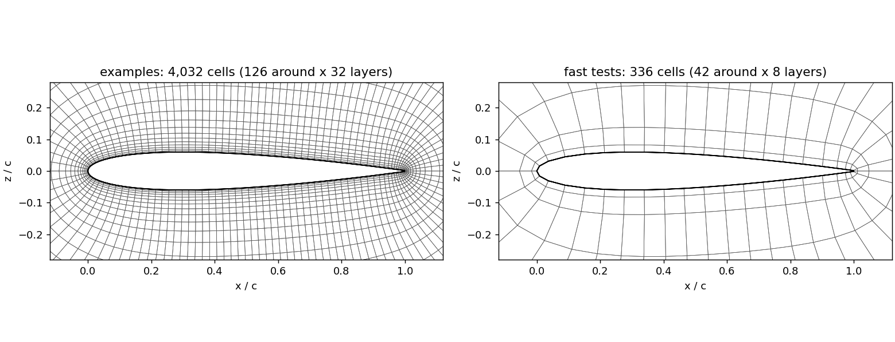
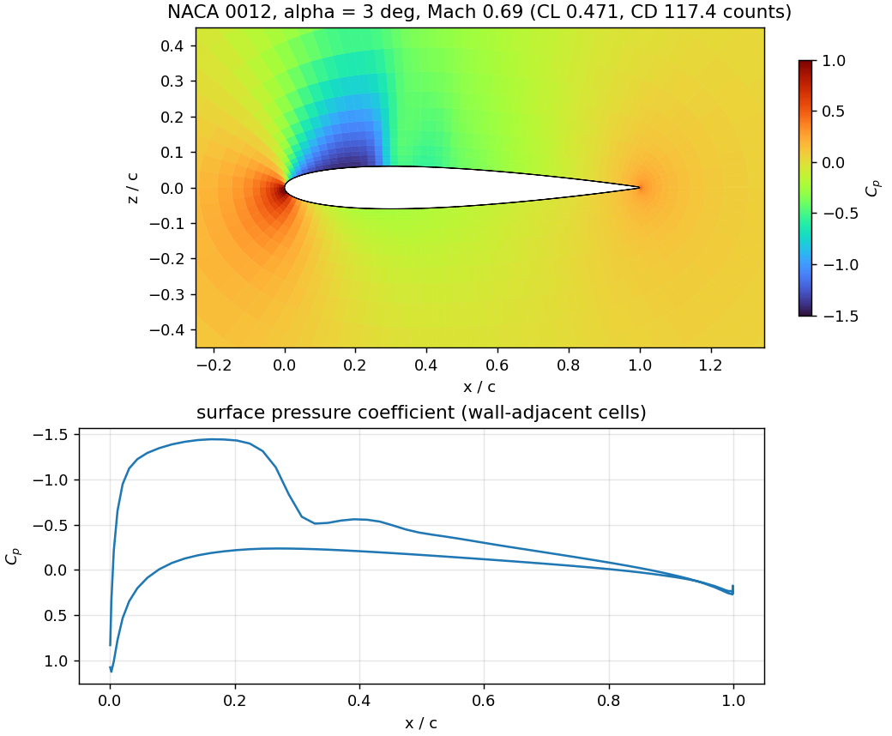
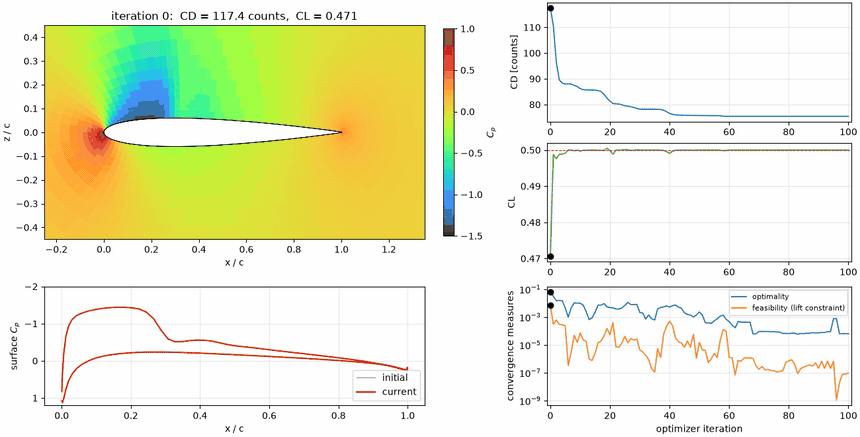
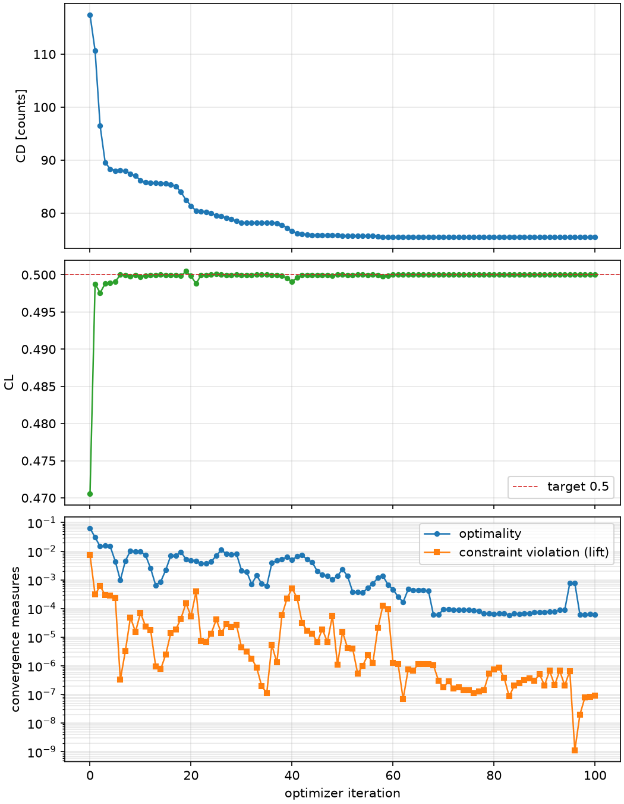

# Examples

Both examples live in `examples/` of the repository and run on the bundled NACA 0012 (chord 1 m, flow along
+x, 4,032-cell one-cell-thick mesh with 126 faces on the airfoil). They are written for `mpirun -np 4`; the
case is re-decomposed for whatever rank count you launch with. Every number and figure below comes from a real run
(DAFoam 5.1.1, ARM64 Linux, 4 ranks); {doc}`status` says what each rests on.

## Analysis: `airfoil_analysis.py`

```bash
mpirun -np 4 python examples/airfoil_analysis.py                      # Euler mode, alpha = 3 deg
mpirun -np 4 python examples/airfoil_analysis.py --case naca0012      # RANS, wall function
mpirun -np 4 python examples/airfoil_analysis.py --aoa 1.5
mpirun -np 4 python examples/airfoil_analysis.py --check-totals       # adjoint vs finite differences
```

**Expected output** (Euler mode, 3 degrees, 238 m/s; it takes seconds):

```text
case=naca0012_euler  warper=jax  alpha=3.0 deg
  CL = 0.47056
  CD = 0.011743  (117.4 counts)
saved analysis.png (C_p contours and surface C_p)
```



The bundled mesh (left) and the 336-cell mesh the fast tests use (right).



The upper surface has a suction peak (C_p = -1.45) ending in a sharp jump at 30% chord: a **shock**, on a NACA 0012 at 3 degrees and
Mach 0.69. That is where the drag comes from, and what the optimization removes.

`--check-totals` additionally compares the adjoint derivatives of CD and CL with respect to the six shape variables and the angle of attack
with finite differences (step 0.01), one flow solve per variable per step: the quickest way to confirm that a new case or option set
produces trustworthy gradients before you spend an optimization on it. On the bundled case the two agree to 0.2 to 2% (below a step of
about 1e-3 the finite differences are noise; see {doc}`status`).

**Walk-through.** The script is a thin shell around the library: `prepare_case` copies and decomposes the case, `build_airfoil_model` builds the
CSDL model (geometry, mesh warp, DAFoam solve), `model.analyze()` runs it and returns CL and CD, and `viz` draws the result. The
same few lines are in {doc}`quickstart`.

## Optimization: `airfoil_optimization.py`

```bash
mpirun -np 4 python examples/airfoil_optimization.py --maxiter 100    # Euler mode (default case), 100 iterations: about 35 min
mpirun -np 4 python examples/airfoil_optimization.py --maxiter 40     # about 7 min; still improving
mpirun -np 4 python examples/airfoil_optimization.py --case naca0012  # the original RANS tutorial setup
mpirun -np 4 python examples/airfoil_optimization.py --no-movie       # skip the movie (the figures are still written)
```

Minimizes CD subject to CL = 0.5 (`--cl-target`) with DAFoam adjoint gradients. The stack is exactly the
lab's: **lsdo_geo** parameterizes the geometry, **IDWarp-JAX** deforms the volume mesh, **DAFoam** solves the flow
and adjoint, **CSDL** assembles the derivatives, and **modOpt's OpenSQP** optimizes.

```bash
mpirun -np 4 python examples/airfoil_optimization.py --optimizer PySLSQP   # SLSQP instead of OpenSQP
mpirun -np 4 python examples/airfoil_optimization.py --warper idwarp       # Fortran IDWarp instead of IDWarp-JAX
mpirun -np 4 python examples/airfoil_optimization.py --adjoint-tol 1e-3    # 29% faster adjoints (measured on one gradient; not run through a full optimization)
```

**Result of the 100-iteration run** (Euler-mode case, IDWarp-JAX, OpenSQP, 4 ranks):

```text
  initial: CL = 0.47056  CD = 117.4 counts
  final:   CL = 0.50000  CD = 75.4 counts
  CD change: -35.8 %
  thickness: [19.6464 35.6686 33.9458]     (percent change at the three interior control points)
  camber: [ 4.1915  8.1936 11.2012]
  angle_of_attack: [0.]                     (at its lower bound)
```

```{raw} html
<video controls loop muted playsinline style="width:100%;max-width:900px">
  <source src="_static/optimization.mp4" type="video/mp4">
  
</video>
```

The movie shows every optimizer iteration: pressure-coefficient contours, surface C_p and the airfoil shape (the initial ones in grey), then
the histories of CD, CL, optimality and feasibility with a marker at the current iteration.

The design that results is visibly thicker, more cambered, and flown at zero angle of attack: the strong suction
peak and shock are replaced by a gently loaded, shock-free upper surface that carries the same lift.



CL reaches its target within six iterations and stays there. Drag falls in steps and stops changing at about iteration 65 (75.42
counts). Optimality reaches about 6e-5 but not the default 1e-5, so modOpt reports "not converged" at the iteration cap even though the
objective no longer moves; the brief optimality spike near iteration 95 is a transient that the optimizer recovers from within two iterations.

Reading it carefully: the mesh is coarse (4,032 cells) and the Euler-mode case has no resolved boundary layer, so the absolute drag numbers
are not physical and the optimum partly exploits the mesh ({doc}`status`). It is a demonstration of the workflow, not a design.

OpenSQP is modOpt's own SQP implementation (BFGS Lagrangian-Hessian approximation, an elastic-mode merit
function that tolerates infeasible QP subproblems, and HiGHS for the QPs). `--maxiter` counts major iterations and
`--tolerance` sets both its optimality and feasibility tolerances (`acc` for PySLSQP). Further OpenSQP options
(`verbosity`, `ls_maxiter`, ...) pass through `AirfoilModel.optimize(**solver_options)`.

Design variables (7):

| Variable | Count | Meaning | Bounds |
| --- | --- | --- | --- |
| `thickness` | 3 | percent change of the local FFD block thickness at the three interior chordwise control points | -100 to 100 |
| `camber` | 3 | vertical shift of the same control points, in percent of the **control-point spacing** (chord/4 for the default 5 points; see {doc}`how-it-works`) | -50 to 50 |
| `angle_of_attack` | 1 | degrees | 0 to 10 |

Outputs, in the working directory (`run/` by default): `optimized_airfoil.npz` (initial and optimized surface
coordinates and the design variables), `history.npz` and `history.png` (CD, CL, and the solution kept for each iteration),
`optimization.png`, `movie.gif` and, if `ffmpeg` is installed, `movie.mp4`, and `ASO_2DAF_rank0_outputs/` (modOpt's own iteration history).

**Walk-through.** `model.optimize(sim, algorithm="OpenSQP", maxiter=...)` wraps the simulator in a modOpt problem; it records CD and CL
at every gradient evaluation (`model.history`), and `viz.make_movie` draws the frames from the solutions DAFoam keeps on disk (about 0.2 s
per frame), so the movie costs the optimization nothing.

## What "Euler mode" means here

DAFoam's compressible solver `DARhoSimpleCFoam` always carries viscous terms and a turbulence model. To
approximate inviscid (Euler) flow, the `naca0012_euler` case takes the RANS case and:

- lowers the constant dynamic viscosity from 1.8e-5 to 1.8e-9 kg/(m s), so the chord Reynolds number rises
  from about 1.5e7 to about 1.5e11, and scales the Spalart-Allmaras seed (`nuTilda`, `nut`) down by the same
  factor 1e4;
- keeps the bundled **coarse** mesh. At this Reynolds number the boundary layer is far thinner than the first
  cell, so with the wall function it carries almost no shear: lift is essentially pressure lift and drag is
  wave drag plus the numerical dissipation of the scheme.

The point is a cheap case (no resolved boundary layer, quick primal and adjoint) in which shock-related drag
dominates, so shape changes that weaken the shock show up clearly in CD. Two caveats follow from it. CD from
this case is **not** a physical drag (there is no skin friction, and the numerical dissipation depends on the
mesh), so compare designs within the case rather than against experiment. And a coarse mesh is a compromise:
optimizers exploit mesh-resolution artifacts, so check any promising shape on a finer mesh or in RANS.


## Your own case

Copy the examples and replace the three ingredients:

1. an OpenFOAM case directory for `DARhoSimpleCFoam` (or adapt `options.naca0012_options`),
2. a STEP file of the same geometry (`lsdo_geo` projects the CFD surface onto it),
3. a DAFoam options dictionary whose `inputInfo` uses only the input types the interface builds
   (`volCoord`, `patchVelocity`, `patchVar` for `p` and `T`).

For a different parameterization, call the pieces in {doc}`how-it-works` directly instead of
`build_airfoil_model`.

## Timings (measured)

On an Apple M5 Max (12 cores), in the Linux VM of {doc}`install-mac`, one analysis or optimization iteration costs:

| | 4,032-cell mesh, 1 rank | 4,032-cell mesh, 4 ranks | 336-cell test mesh |
| --- | --- | --- | --- |
| build the model (geometry, projection, IDWarp-JAX, DAFoam start-up, first solve) | 9 s | 5 s | 3 s |
| forward solve after an optimizer-sized design change (warm-started) | 3.9 s | 1.4 s | 0.2 s |
| adjoint derivatives (CD and CL) at the base design | | 7 s | 0.7 s |
| ... at a design with a stronger shock (CL 0.58) | 101 s | 31 s | |
| first `compute_totals` (adds a one-time ~5 s JAX compile) | | about 17 s (not re-timed since a bug fix; see {doc}`status`) | 5.6 s |

The adjoint dominates and depends on the flow state: it takes 260 GMRES iterations per output at an easy state and many more near a shock.
Four ranks give about 3.3x over one on the 4,032-cell mesh; the 336-cell mesh is too small to gain from more ranks. The complete
optimizations on the 4,032-cell mesh, 4 ranks: **40 iterations, 50 gradient evaluations, 430 s (7 min)**; **100 iterations, about 35 minutes** (the movie
above; later iterations cost more because the adjoint is harder near the final shape); about a second per iteration on the 336-cell mesh. Nothing here uses a GPU: DAFoam and OpenFOAM are CPU-only.

## Speeding it up

Measured on the 4,032-cell mesh, 4 ranks, at one design, adjoint only (`scripts/vm/timing.py` with environment settings):

| Change | Adjoint time | Derivatives vs the default (max relative difference) | Verdict |
| --- | --- | --- | --- |
| default (adjoint tolerance 1e-6) | 7.0 s | | |
| adjoint tolerance 1e-4 | 5.6 s (-20%) | 3e-5 | free |
| adjoint tolerance 1e-3 | 5.0 s (-29%) | 7e-4 | good; use `--adjoint-tol 1e-3` |
| preconditioner recomputed every 3rd evaluation (`adjPCLag`) | 8.8 s (+26%) | 4e-7 | slower here; do not |
| primal tolerance 1e-6 (default 1e-8) | forward solve 1.0 s instead of 1.4 s | 7e-3 | not worth the gradient error |

Finite-difference noise on these derivatives is about 1e-2, so the looser adjoint tolerances change nothing that matters to the optimizer.
Other levers, not measured here: the 336-cell mesh for exploring (about 10x cheaper per iteration, but crude); fewer or better-scaled design
variables; and, for large 3D meshes, more ranks. A looser optimizer tolerance will not shorten the 40-iteration optimization by itself:
it never met the default tolerance, and it plateaued for five iterations (31 to 35) before improving again, so a looser tolerance risks
stopping at the plateau.
