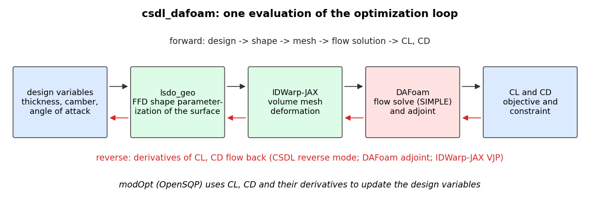

# csdl_dafoam

**csdl_dafoam** connects [DAFoam](https://dafoam.github.io) (OpenFOAM with a discrete adjoint) to
[CSDL](https://github.com/LSDOlab/CSDL_alpha) so that CFD-based aerodynamic shape optimization can be
written as an ordinary CSDL model: geometry parameterization with
[`lsdo_geo`](https://github.com/LSDOlab/lsdo_geo), mesh deformation with
[IDWarp-JAX](https://github.com/LSDOlab/idwarp-jax), DAFoam flow solves and adjoint gradients, and an optimizer
from [modOpt](https://github.com/LSDOlab/modopt) (OpenSQP by default).

```{raw} html
<video controls autoplay loop muted playsinline style="width:100%;max-width:900px">
  <source src="_static/optimization.mp4" type="video/mp4">
  
</video>
```

*A NACA 0012 optimized for minimum drag at CL = 0.5 (Euler-mode case, 4,032 cells), 100 iterations of OpenSQP with DAFoam
adjoint gradients: the pressure field, surface pressure coefficient and airfoil shape of every iteration, with the drag, lift,
optimality and feasibility histories. The strong shock at 30% chord is gone and CD falls from 117 to 75 counts (-36%). See {doc}`examples`.*

## How the pieces fit



What is here:

- an installable Python package (`pip install`); DAFoam itself is compiled from source, with a verified, reproducible procedure for
  an Apple-silicon Mac (through a Linux VM) and for Linux ({doc}`installation`)
- two ready-to-run examples on a bundled NACA 0012 case: an analysis, and an optimization in "Euler mode" (coarse mesh, very high
  Reynolds number) or RANS ({doc}`examples`)
- a built-in visualization tool for flow solutions, including a movie of an optimization ({doc}`visualization`)
- a test suite that runs in about a minute and a half (25 s for the quick subset) without DAFoam, by checking the CSDL/DAFoam wiring against linear fake solvers with exactly known
  derivatives, plus real-solver tests ({doc}`development`)

```{important}
Verified on a real DAFoam 5.1.1 / OpenFOAM v2506 built from source on **ARM64 Linux** only. The conda packages are experimental and have
not been built; x86-64 has not been tried; the 3D visualization functions are untested on a real 3D case.
{doc}`status` lists exactly what has and has not been verified.
```

```{toctree}
:maxdepth: 2
:caption: Contents

installation
install-mac
install-linux
quickstart
examples
visualization
how-it-works
migration
development
status
```
